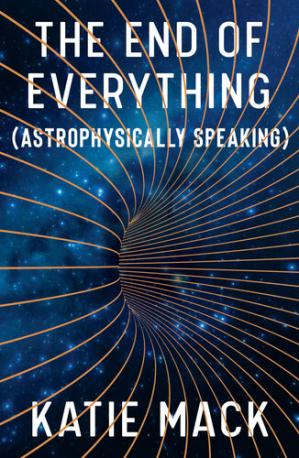
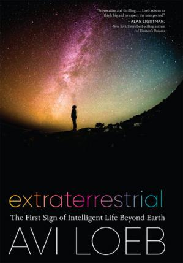

+++
title = "3 Buchempfehlungen"
description = "3 Bücher mit überzeugendem Konzept"

date = 2021-09-03

[taxonomies]
tags = ["books", "german"]
authors = ["sig"]
+++

Gerne möchten wir Dir hier einige Bücher vorstellen. Wir sind überzeugt, dass Du deren Kauf (oder Ausleihe, wenns denn sein muss) nicht bereuen wirst!

# The End of Everything (Astrophysically Speaking) 

Die Astrophysikerin [Katie Mack](https://en.wikipedia.org/wiki/Katie_Mack_%28astrophysicist%29) (North Carolina State University) gelingt es, in diesem Buch komplexe astrophysikalische Themen einfach und anschaulich zu erklären. Sogar so einfach, dass selbst wir als absolute Laien meinen, das meiste verstanden zu haben. Sie beginnt konsequenterweise mit Ausführungen dazu, wie das Universum überhaupt angefangen hat. Und was einmal anfängt, wird mutmasslich auch wieder enden. Für das Universum gibt es hierfür nach aktuellem Forschungsstand mehrere Möglichkeiten, welche alle in diesem Buch in wunderbar angenehmer Sprache, gewürzt mit etwas Humor und Sarkasmus, veranschaulicht werden.

> We know the universe had a beginning. But what happens at the end of the story?

Eine absolute Buchempfehlung, wenn du dir gelegentlich Fragen wie "Warum sind wir überhaupt? Und warum ist überhaupt etwas?" stellst.

* Jahr: 2020
* ISBN: B07Z19S2MY
* Seiten: 226
* Sprache: Englisch

# Extraterrestrial: The First Sign of Intelligent Life Beyond Earth

Gleich vorweg: Ja, hier geht es um Aliens. So richtig! Aber Achtung: Dieses Buch stammt nämlich nicht vom nächst besten Verschwörungstheoretiker, sondern von [Avi Loeb](https://en.wikipedia.org/wiki/Avi_Loeb). Und dieser ist Professor für Astrophysik an der Harvard Universität.

Im Buch geht es um die Frage, ob das erste von den Menschen beobachtet Interstellare Objekt tatsächlich von Aliens abstammen könnte. Avi Loeb ist da ganz klarer Meinung. Was er schreibt ist natürlich gestützt auf und erklärt mit zahlreichen wissenschaftlichen Publikationen. Selbstverständlich alles so erklärt, dass wir Laien auch alles mehr oder weniger verstehen können. Ob er nun Recht hat oder nicht - ein Grund, warum es dieses Buch in diese Empfehlungsliste geschafft hat, ist folgender: Herrn Loeb pflegt auch eine gewisse Leidenschaft zur Philosophie. Das ganze Buch hindurch wird nämlich die Frage `Sind wir alleine?` nicht nur auf astrophysikalischere Ebene, sonder auch auf philosophische Weise diskutiert. Das Resultat ist ein sehr spannendes und aufregendes Werk, welches zum Träumen und Phantasieren geradezu anregt.

* Jahr: 2021
* ISBN: 2020023330
* Seiten: 200
* Sprache: Englisch

# Kaffee und Zigaretten 

Für einmal genug Astrophysik. Das Werk von Schriftsteller und Rechtsanwalt [Ferdinand von Schirarch](https://en.wikipedia.org/wiki/Ferdinand_von_Schirach) ist eine Sammlung von Kurzgeschichten und Anekdoten. Es geht um Moral, Gerechtigkeit und Schuld. Menschliches, und was es bedeutet, Mensch zu sein. Mitten aus dem Leben, quasi.

Der Autor geniesst inzwischen gewisse Bekanntheit unter den deutschen Schriftstellern. Falls du seine Werke noch nicht kennst, bietet dieses Buch einen guten, abgerundeten Einblick in sein schriftstellerischen Schaffen. Für uns eine Art `literarisches Desert`.

* Jahr: 2019
* ISBN: 978-3-630-87610-8
* Seiten: 192
* Sprache: Deutsch
